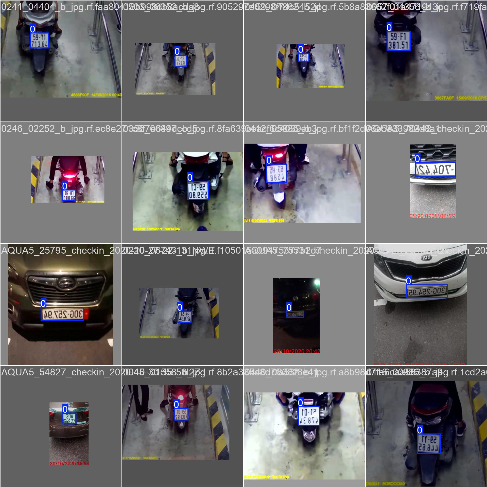
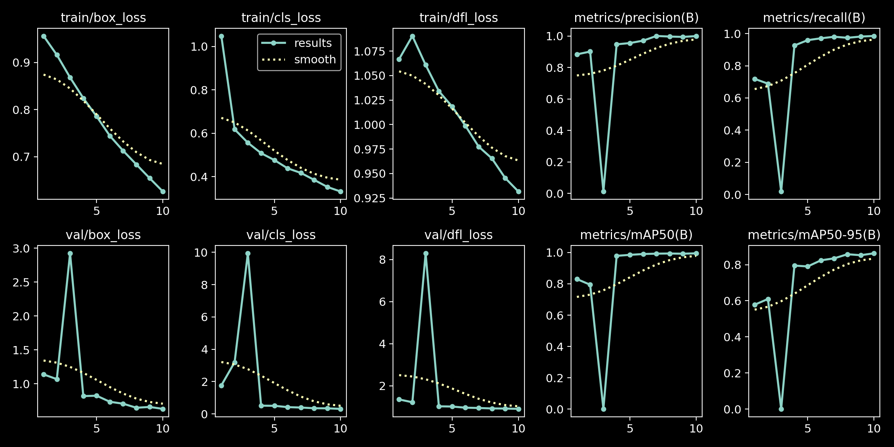

# License-plate-recognition

This project implements an advanced license plate recognition system using state-of-the-art object detection and optical character recognition (OCR) technologies.<br/> The pipeline integrates **YOLOv11📸** for license plate detection, **OpenCV** for image preprocessing, and GOT-OCR2_0 from **huggingface🤗** for text extraction.

### pipeline

- Detect Bounding Boxes
YOLOv11 is used to detect bounding boxes around license plates in images. The model is fine-tuned on a custom license plate dataset.

- Preprocess and Crop
OpenCV is used to preprocess and crop the detected license plates, ensuring proper alignment and contrast for accurate OCR results.

- Apply OCR
GOT-OCR2_0, a pretrained OCR model from Hugging Face, extracts text from the processed license plate images.

### Project Architecture
### 1. Object Detection with YOLOv11 📸
#### Purpose
- Detect and localize license plates in input images
- High-precision bounding box generation

#### Training Configuration

- Model Summary: 238 layers, 2,582,347 parameters
- Performance Metrics:
  - Precision: 0.999
  - Recall: 0.985
  - mAP50: 0.995
  - mAP50-95: 0.864



### 2. Image Preprocessing with OpenCV

#### Preprocessing Pipeline
1. Crop license plate region
2. Convert to grayscale
3. Apply adaptive thresholding
4. Perform dilation and erosion
5. Detect and correct image rotation
6. Apply advanced cleaning techniques

### 3. Optical Character Recognition with GOT-OCR2_0 🤗
- Extract text from preprocessed license plate images

#### Model Configuration
```python
tokenizer = AutoTokenizer.from_pretrained('ucaslcl/GOT-OCR2_0', trust_remote_code=True)
model = AutoModel.from_pretrained('ucaslcl/GOT-OCR2_0', 
    trust_remote_code=True, 
    low_cpu_mem_usage=True, 
    device_map='cuda', 
    use_safetensors=True, 
    pad_token_id=tokenizer.eos_token_id
)
model = model.eval().cuda()
```

### 4. Full Pipeline Workflow
1. Load input image
2. Detect license plate using YOLOv11
3. Preprocess and crop license plate region
4. Apply OCR to extract text
5. Visualize results

#### Pipeline Output


## Requirements
- PyTorch
- OpenCV
- Transformers
- Matplotlib
- CUDA-enabled GPU recommended

## Usage
```python
coordinates = getBoundingBox(image_path)
_, processed_image = process_pipeline(image_path, coordinates)
result = apply_ocr(processed_image)
```

## Future Improvements
- Expand dataset diversity
- Implement multi-language support
- Enhance preprocessing robustness
- Add error handling and validation